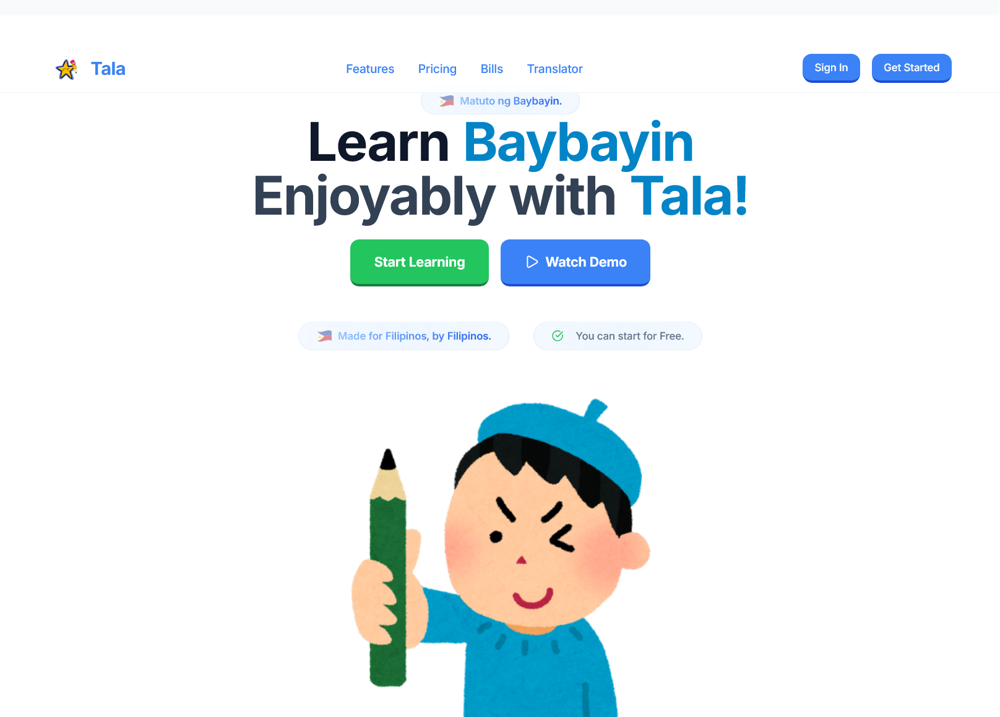

# Tala - Baybayin Learning App




Tala is an app for learning and preserving the Baybayin.

## Features

- **Baybayin Translator** - Convert names and text to ancient Filipino script
- **Interactive Learning** - Step-by-step lessons with modern UI
- **Philippine Legislation** - Access official Baybayin laws and bills
- **Cultural Heritage** - Connect with pre-colonial Filipino identity

## Tech Stack

- **Frontend:** React 18 + TypeScript + Vite
- **Styling:** Tailwind CSS + Duolingo-inspired components
- **Backend:** Node.js + Express + TypeScript
- **Database:** MongoDB + Mongoose
- **Authentication:** JWT + bcrypt

## Getting Started

### Prerequisites
- Node.js 18+
- MongoDB

### Installation

1. Clone the repository:
```bash
git clone https://github.com/yourusername/tala-app.git
cd tala-app
```

2. Install client dependencies:
```bash
cd client
npm install
```

3. Install server dependencies:
```bash
cd ../server
npm install
```

### Development

1. Start the server (Terminal 1):
```bash
cd server
npm run dev
```

2. Start the client (Terminal 2):
```bash
cd client
npm run dev
```

- **Frontend:** http://localhost:3000
- **Backend:** http://localhost:5000

### Environment Setup

Create `server/.env`:
```env
NODE_ENV=development
PORT=5000
MONGODB_URI=mongodb://localhost:27017/tala
JWT_SECRET=your-secret-key
JWT_EXPIRE=7d
```

## Project Structure

```
tala-app/
├── client/ # React frontend
│ ├── src/
│ │ ├── components/ # Reusable UI components
│ │ ├── pages/ # Route components
│ │ ├── utils/ # Helper functions
│ │ └── types/ # TypeScript definitions
│ └── public/
├── server/ # Express backend
│ ├── src/
│ │ ├── controllers/ # Route handlers
│ │ ├── models/ # Database schemas
│ │ ├── routes/ # API endpoints
│ │ └── utils/ # Server utilities
│ └── dist/ # Compiled JavaScript
└── README.md
```

## API Endpoints

- `GET /api/health` - Server status
- `POST /api/auth/register` - User registration
- `POST /api/auth/login` - User authentication
- `GET /api/user/profile` - User profile

## Scripts

### Client
- `npm run dev` - Development server
- `npm run build` - Production build
- `npm run preview` - Preview build

### Server
- `npm run dev` - Development with nodemon
- `npm run build` - Compile TypeScript
- `npm run start` - Production server

## Contributing

1. Fork the repository
2. Create a feature branch (`git checkout -b feature/amazing-feature`)
3. Commit your changes (`git commit -m 'Add amazing feature'`)
4. Push to the branch (`git push origin feature/amazing-feature`)
5. Open a Pull Request

## License

MIT License - see [LICENSE](LICENSE) file for details.

## Acknowledgments

- **Philippine Congress** - Official Baybayin legislation
- **Filipino Heritage Community** - Cultural preservation efforts
- **Open Source Contributors** - Development tools and libraries

---

**Made by KierFR**
